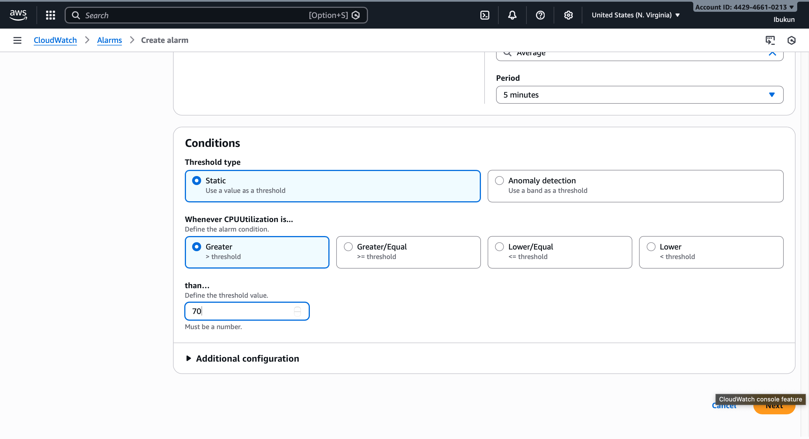
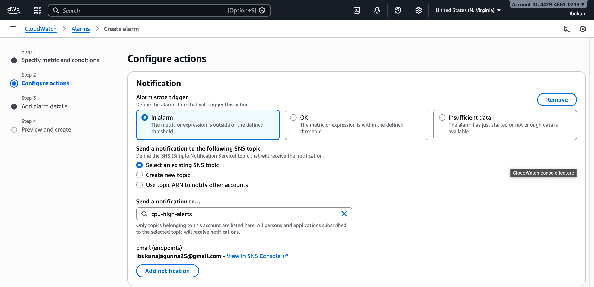
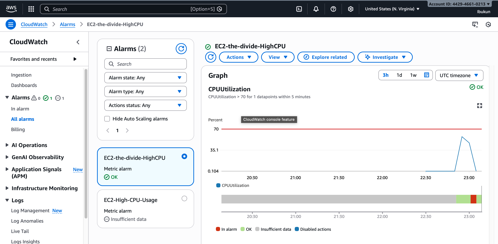
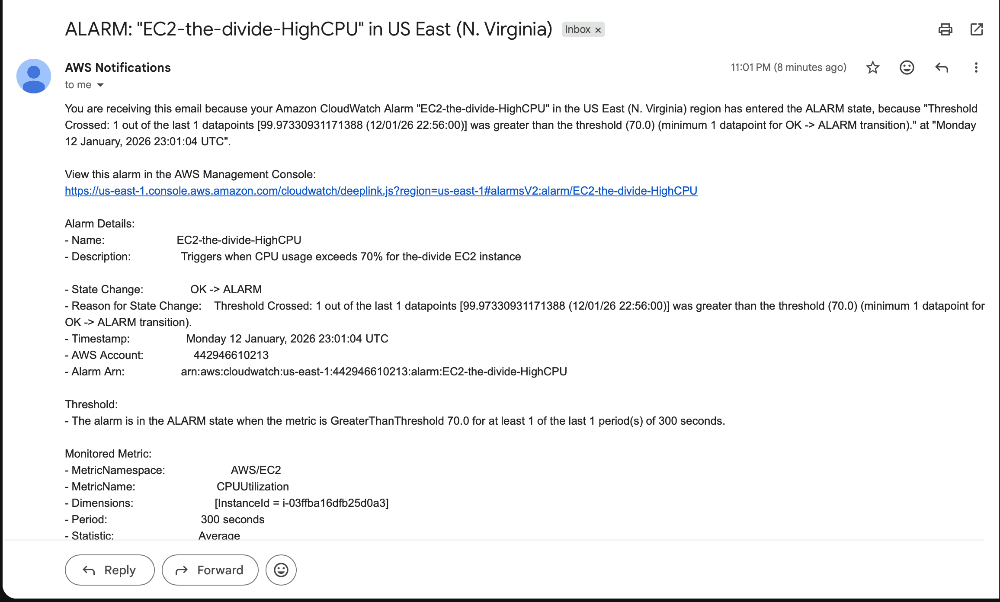

# CloudWatch Alarm – High CPU Utilization

## Alarm Configuration

## Notification Setup

## Alarm Triggered

## Email Notification

## Root Cause Simulation
CPU usage was intentionally increased using a stress test to validate monitoring and alerting functionality.

## Resolution
CPU-intensive process completed, and utilization returned to normal levels.

## Why Monitoring Matters
Monitoring enables operations teams to detect performance issues early, respond before users are impacted, and maintain system reliability through proactive alerting.
