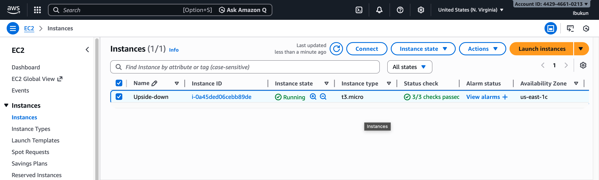
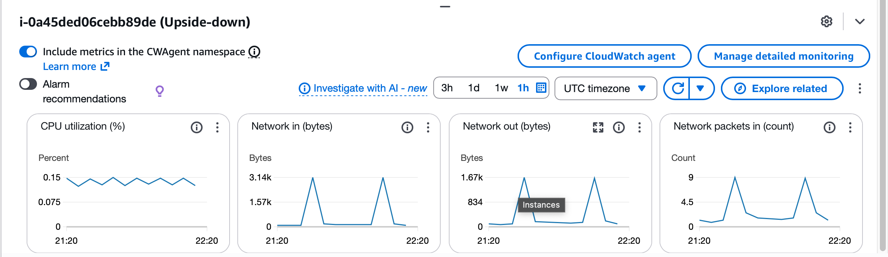
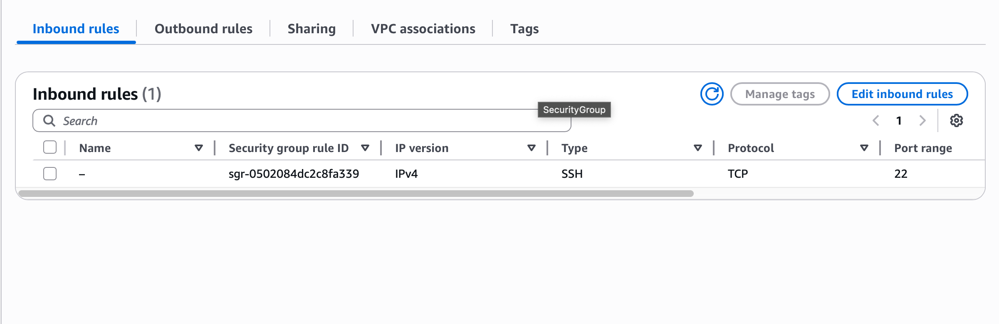
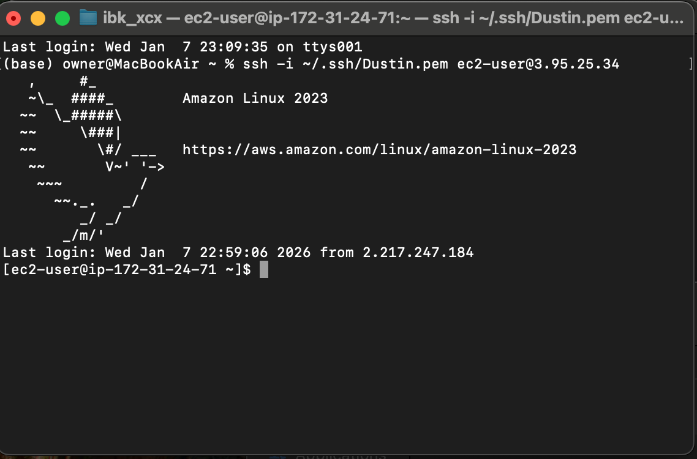

# EC2 Connectivity Issue – Security Group Misconfiguration

## Issue Summary
An EC2 instance became unreachable due to inbound security group rules being removed, blocking SSH access.

## Diagnosis

### EC2 Instance Status Check
- Verified instance was running with 3/3 status checks passed  

---

### System Logs Review
- Reviewed system logs and confirmed no boot errors  

---

### CloudWatch Metrics
- Checked CloudWatch metrics; instance showed activity but no inbound connections  

---

### Security Group Inspection
- Inspected security group inbound rules and identified missing SSH access  

---

## Resolution
- Re-added inbound rule to allow SSH (port 22) from my IP

- Verified connectivity restored via SSH

---

## Preventive Actions
- Apply change control to security group modifications
- Use baseline security group templates
- Enable monitoring alerts for connectivity failures
